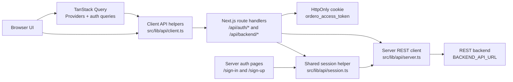
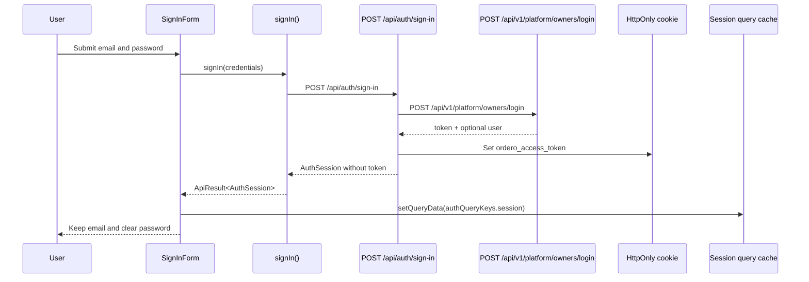
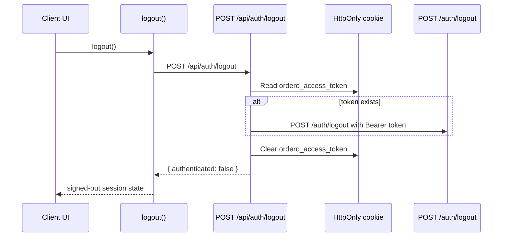
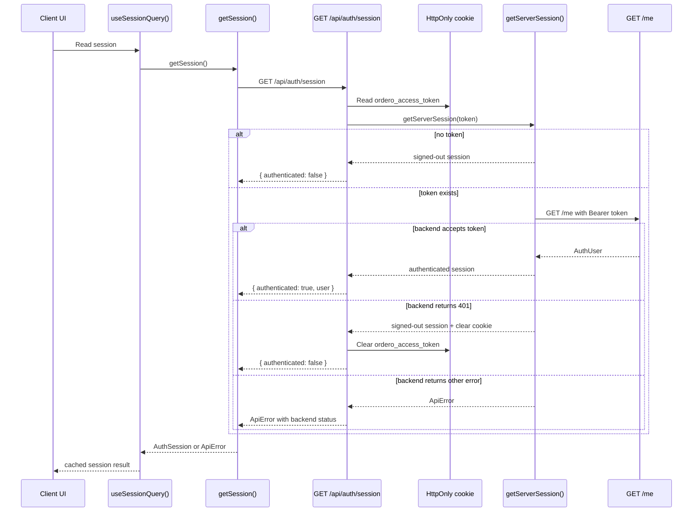
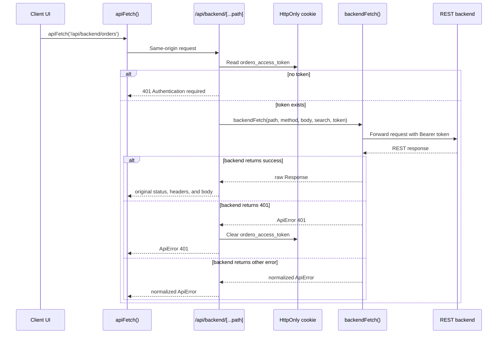
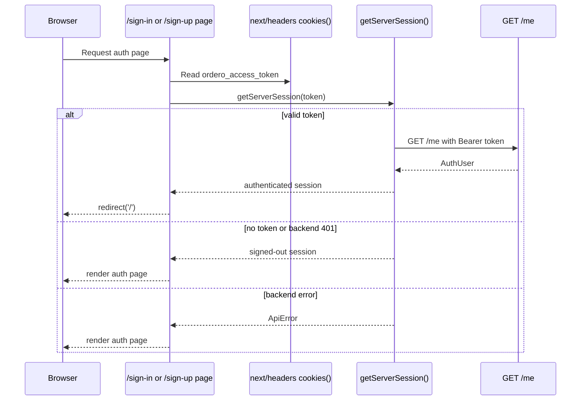
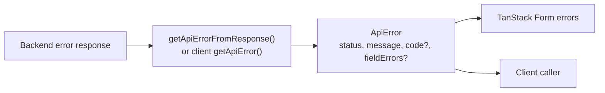

# HTTP and Auth Architecture

`apps/platform` uses a BFF-style HTTP architecture for authenticated REST
requests. The browser never reads the JWT directly. Next.js route handlers own
the token cookie and forward authenticated requests to the backend with a Bearer
header. Server-rendered auth pages reuse the same backend validation rules
through a shared session helper instead of relying on middleware redirects.

## Boundaries



Key rules:

- Client components call same-origin `/api/*` routes.
- The JWT is stored in the `ordero_access_token` HttpOnly cookie.
- Server route handlers read the cookie and attach `Authorization: Bearer ...`.
- Server auth pages use the shared `getServerSession()` helper before render.
- Cached reads use TanStack Query. Auth actions and mutations use direct
  uncached calls.

## Core Schemas

Public auth and error shapes live in `src/lib/api/types.ts`.

```ts
type AuthUser = {
  id?: string;
  email?: string;
  name?: string;
  [key: string]: unknown;
};

type AuthSession =
  | {
      authenticated: true;
      user?: AuthUser;
    }
  | {
      authenticated: false;
    };

type ApiError = {
  status: number;
  message: string;
  code?: string;
  fieldErrors?: Record<string, string>;
};
```

Server-side session resolution uses a separate internal result shape:

```ts
type ServerSessionResult =
  | {
      ok: true;
      session: AuthSession;
      shouldClearAuthCookie: boolean;
    }
  | {
      ok: false;
      error: ApiError;
      shouldClearAuthCookie: false;
    };
```

## Sign-In Flow

The sign-in form submits credentials through the client API. The backend returns
a token, but the browser only receives safe session data.



Failure behavior:

- invalid JSON returns `400`
- backend errors are normalized as `ApiError`
- backend `fieldErrors` are mapped back into TanStack Form
- backend form-level errors are shown through the shared toast surface
- a missing `token` from the backend returns `502`

## Logout Flow

Logout clears the local auth cookie even if the backend logout endpoint is
unavailable or returns an error.



## Session Read and Cache Flow

Session state is the first cached read. The query calls the same-origin session
route, which delegates token validation to the shared `getServerSession()`
helper.



Caching rules:

- default query `staleTime` is `60_000`
- query retries are disabled by default
- the session key is `authQueryKeys.session`
- login seeds the session cache after success

## Authenticated Backend Request Flow

Feature code should call `/api/backend/*` when it needs authenticated REST data
from the backend.



Forwarding rules:

- supports `GET`, `POST`, `PUT`, `PATCH`, and `DELETE`
- preserves successful backend response status codes and headers
- preserves query string search params
- forwards only selected headers: `accept` and `content-type`
- forwards bodies for non-`GET` and non-`HEAD` methods
- never forwards browser-readable JWT state because the browser cannot read the
  HttpOnly cookie

## Auth Page Guard Flow

Auth-page redirects now happen in the server page layer, not in `proxy.ts`.
`/sign-in` and `/sign-up` call `hasAuthenticatedServerSession()`, which reads
the cookie through `next/headers` and reuses `getServerSession()`.



Current guard behavior:

- authenticated users are redirected away from `/sign-in` and `/sign-up`
- stale cookies do not block access to auth pages
- backend outages do not block auth-page rendering
- protected application routes are intentionally not guarded yet

## Error Shape

Route handlers and client helpers normalize backend failures into `ApiError`.



`fieldErrors` are optional and currently shaped as `Record<string, string>`.
When present, sign-in and sign-up map them into TanStack Form submit errors.

## Review Checklist

- Start with `src/lib/api/types.ts` to confirm the public shapes.
- Review `src/lib/api/session.ts` for shared session resolution and cookie-clear
  decisions.
- Review `src/lib/api/server.ts` for backend URL handling, Bearer header logic,
  cookie helpers, error normalization, and raw-response forwarding.
- Review `/api/auth/*` route handlers for cookie ownership and safe session
  responses.
- Review `src/lib/api/authPageGuard.ts` and the auth pages for redirect
  decisions before render.
- Review `/api/backend/[...path]` for request forwarding and 401 cleanup.
- Review `SignInForm.tsx` for the first feature integration.
