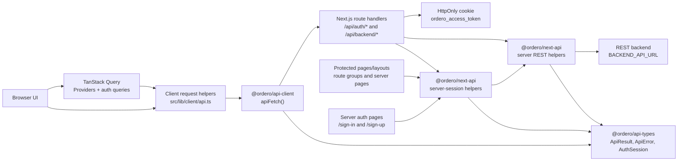
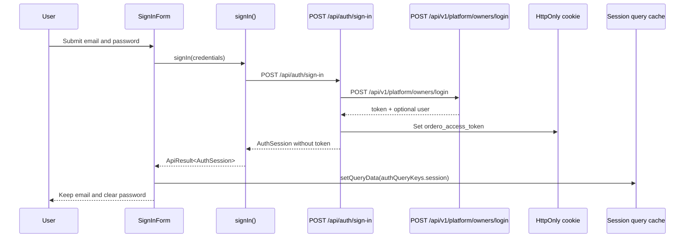
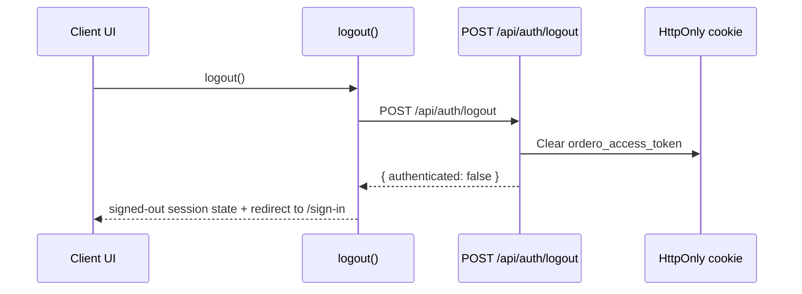
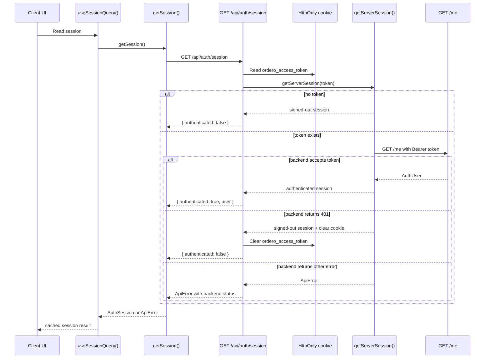
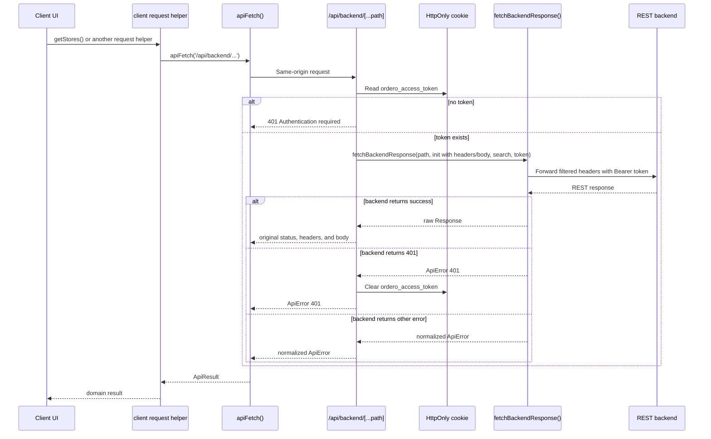
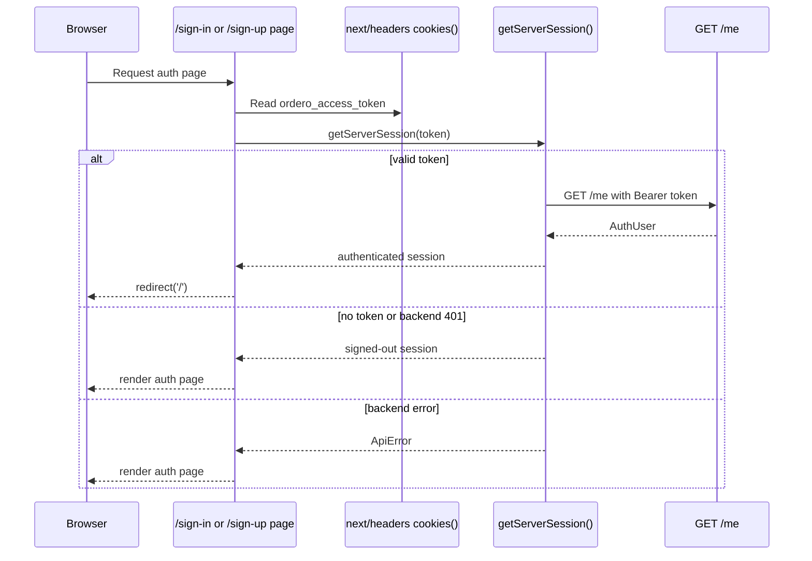
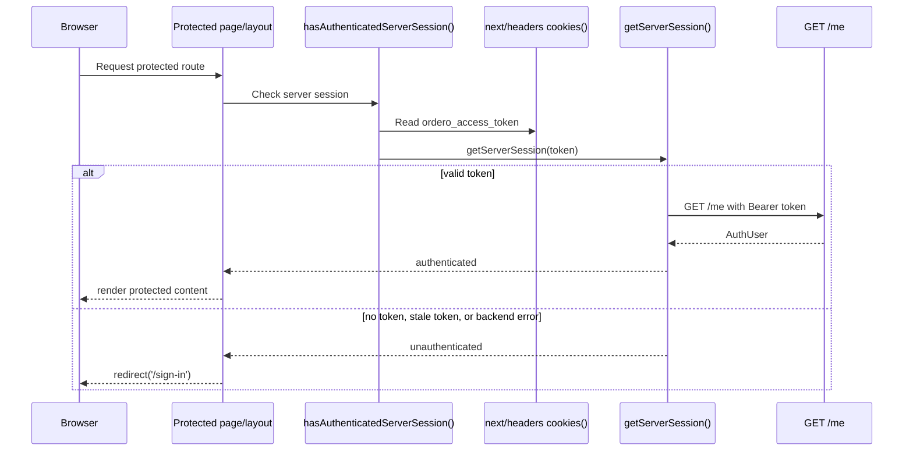
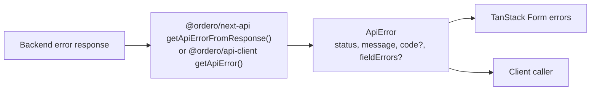

# HTTP and Auth Architecture

`apps/platform` and `apps/store` use a BFF-style HTTP architecture for
authenticated REST requests. The browser never reads the JWT directly. Next.js
route handlers own the token cookie and forward authenticated requests to the
backend with a Bearer header. Server-rendered auth pages and protected route
groups reuse the same backend validation rules through shared server helpers
instead of relying on middleware redirects.

## Boundaries


```mermaid
flowchart LR
  browser["Browser UI"]
  authPage["Server auth pages<br/>/sign-in and /sign-up"]
  protectedPage["Protected pages/layouts<br/>route groups and server pages"]
  clientApi["Client request helpers<br/>src/lib/client/api.ts"]
  clientFetch["@ordero/api-client<br/>apiFetch()"]
  query["TanStack Query<br/>Providers + auth queries"]
  nextApi["Next.js route handlers<br/>/api/auth/* and /api/backend/*"]
  cookie["HttpOnly cookie<br/>ordero_access_token"]
  session["@ordero/next-api<br/>server-session helpers"]
  serverApi["@ordero/next-api<br/>server REST helpers"]
  types["@ordero/api-types<br/>ApiResult, ApiError, AuthSession"]
  backend["REST backend<br/>BACKEND_API_URL"]

  authPage --> session
  protectedPage --> session
  browser --> clientApi
  browser --> query
  query --> clientApi
  clientApi --> clientFetch
  clientFetch --> nextApi
  nextApi --> cookie
  nextApi --> session
  session --> serverApi
  nextApi --> serverApi
  clientFetch --> types
  session --> types
  serverApi --> types
  serverApi --> backend
```

Key rules:

- Client components call same-origin `/api/*` routes.
- The JWT is stored in the `ordero_access_token` HttpOnly cookie.
- Server route handlers read the cookie and attach `Authorization: Bearer ...`.
- Server auth pages use the shared `getServerSession()` helper before render.
- Protected pages and layouts use the same server-session guard before render.
- Cached reads use TanStack Query. Auth actions and mutations use direct
  uncached calls.
- App-owned request helpers and route handlers may use local wrappers under
  `src/lib/api/*` and `src/lib/client/*`, but shared transport behavior lives in
  `@ordero/api-client`, `@ordero/api-types`, and `@ordero/next-api`.

## Core Schemas

Shared auth/result/error contracts live in `@ordero/api-types`. App-specific
user and payload types stay in each app.

```ts
type AuthUser = {
  id?: string;
  email?: string;
  name?: string;
  [key: string]: unknown;
};

type AuthSession = SharedAuthSession<AuthUser>;

type ApiError = {
  status: number;
  message: string;
  code?: string;
  fieldErrors?: Record<string, string>;
};
```

Server-side session resolution uses a separate internal result shape:

```ts
type ServerSessionResult<TUser = unknown> =
  | {
      ok: true;
      session: AuthSession<TUser>;
      shouldClearAuthCookie: boolean;
    }
  | {
      ok: false;
      error: ApiError;
      shouldClearAuthCookie: false;
    };
```

## Sign-In Flow

The sign-in form submits credentials through the client API. The backend returns
a token, but the browser only receives safe session data.


```mermaid
sequenceDiagram
  participant User
  participant Form as SignInForm
  participant Client as signIn()
  participant Route as POST /api/auth/sign-in
  participant Backend as POST /api/v1/platform/owners/login
  participant Cookie as HttpOnly cookie
  participant Query as Session query cache

  User->>Form: Submit email and password
  Form->>Client: signIn(credentials)
  Client->>Route: POST /api/auth/sign-in
  Route->>Backend: POST /api/v1/platform/owners/login
  Backend-->>Route: token + optional user
  Route->>Cookie: Set ordero_access_token
  Route-->>Client: AuthSession without token
  Client-->>Form: ApiResult<AuthSession>
  Form->>Query: setQueryData(authQueryKeys.session)
  Form-->>User: Keep email and clear password
```

Failure behavior:

- invalid JSON returns `400`
- backend errors are normalized as `ApiError`
- backend `fieldErrors` are mapped back into TanStack Form
- backend form-level errors are shown through the shared toast surface
- a missing `token` from the backend returns `502`

## Logout Flow

Logout is local-only for the store app. It clears the local auth cookie without
calling a backend logout service, then the client redirects the user to
`/sign-in`.


```mermaid
sequenceDiagram
  participant UI as Client UI
  participant Client as logout()
  participant Route as POST /api/auth/logout
  participant Cookie as HttpOnly cookie

  UI->>Client: logout()
  Client->>Route: POST /api/auth/logout
  Route->>Cookie: Clear ordero_access_token
  Route-->>Client: { authenticated: false }
  Client-->>UI: signed-out session state + redirect to /sign-in
```

## Session Read and Cache Flow

Session state is the first cached read. The query calls the same-origin session
route, which delegates token validation to the shared `getServerSession()`
helper.


```mermaid
sequenceDiagram
  participant UI as Client UI
  participant Query as useSessionQuery()
  participant Client as getSession()
  participant Route as GET /api/auth/session
  participant Cookie as HttpOnly cookie
  participant Session as getServerSession()
  participant Backend as GET /me

  UI->>Query: Read session
  Query->>Client: getSession()
  Client->>Route: GET /api/auth/session
  Route->>Cookie: Read ordero_access_token
  Route->>Session: getServerSession(token)
  alt no token
    Session-->>Route: signed-out session
    Route-->>Client: { authenticated: false }
  else token exists
    Session->>Backend: GET /me with Bearer token
    alt backend accepts token
      Backend-->>Session: AuthUser
      Session-->>Route: authenticated session
      Route-->>Client: { authenticated: true, user }
    else backend returns 401
      Session-->>Route: signed-out session + clear cookie
      Route->>Cookie: Clear ordero_access_token
      Route-->>Client: { authenticated: false }
    else backend returns other error
      Session-->>Route: ApiError
      Route-->>Client: ApiError with backend status
    end
  end
  Client-->>Query: AuthSession or ApiError
  Query-->>UI: cached session result
```

Caching rules:

- default query `staleTime` is `60_000`
- query retries are disabled by default
- the session key is `authQueryKeys.session`
- login seeds the session cache after success

## Shared Package Roles

- `@ordero/api-types` owns `Token`, generic `AuthSession<TUser = unknown>`,
  `ApiError`, and `ApiResult<T>`.
- `@ordero/api-client` owns browser-safe `apiFetch<T>()` behavior.
- `@ordero/next-api` owns server-only backend fetch, auth cookie, token,
  session-resolution, and auth-page guard primitives.
- Apps own domain request helpers, route constants, form payloads, user shapes,
  and feature-specific backend resource types.

See `docs/packages.md` for the package boundary reference.

## Authenticated Backend Request Flow

Feature code should call `/api/backend/*` when it needs authenticated REST data
from the backend. Keep feature-facing request helpers in `src/lib/client/api.ts`
and use the generic `apiFetch()` transport/error-normalization helper from
`@ordero/api-client`.


```mermaid
sequenceDiagram
  participant UI as Client UI
  participant Helper as client request helper
  participant Fetch as apiFetch()
  participant Proxy as /api/backend/[...path]
  participant Cookie as HttpOnly cookie
  participant Server as fetchBackendResponse()
  participant Backend as REST backend

  UI->>Helper: getStores() or another request helper
  Helper->>Fetch: apiFetch('/api/backend/...')
  Fetch->>Proxy: Same-origin request
  Proxy->>Cookie: Read ordero_access_token
  alt no token
    Proxy-->>Fetch: 401 Authentication required
  else token exists
    Proxy->>Server: fetchBackendResponse(path, init with headers/body, search, token)
    Server->>Backend: Forward filtered headers with Bearer token
    Backend-->>Server: REST response
    alt backend returns success
      Server-->>Proxy: raw Response
      Proxy-->>Fetch: original status, headers, and body
    else backend returns 401
      Server-->>Proxy: ApiError 401
      Proxy->>Cookie: Clear ordero_access_token
      Proxy-->>Fetch: ApiError 401
    else backend returns other error
      Server-->>Proxy: normalized ApiError
      Proxy-->>Fetch: normalized ApiError
    end
  end
  Fetch-->>Helper: ApiResult
  Helper-->>UI: domain result
```

Forwarding rules:

- supports `GET`, `POST`, `PUT`, `PATCH`, and `DELETE`
- preserves successful backend response status codes and headers
- preserves query string search params
- forwards only selected headers: `accept`, `content-type`, and `origin`
- forwards `origin` intentionally because the backend uses it for
  tenant/domain resolution; do not add other browser headers unless they become
  explicit backend contracts
- route handlers pass request headers through `init.headers`; `fetchBackendResponse()`
  always filters them through `getForwardHeaders()` before calling the backend
- do not create alternate forwarding inputs that can bypass the shared
  `FORWARDED_HEADER_NAMES` allow-list
- forwards bodies for non-`GET` and non-`HEAD` methods
- never forwards browser-readable JWT state because the browser cannot read the
  HttpOnly cookie

## Auth Page Guard Flow

Auth-page redirects happen in the server page layer, not in `proxy.ts`.
`/sign-in` and `/sign-up` call `hasAuthenticatedServerSession()`, which reads
the cookie through `next/headers` and reuses `getServerSession()`.


```mermaid
sequenceDiagram
  participant Browser
  participant Page as /sign-in or /sign-up page
  participant Cookie as next/headers cookies()
  participant Session as getServerSession()
  participant Backend as GET /me

  Browser->>Page: Request auth page
  Page->>Cookie: Read ordero_access_token
  Page->>Session: getServerSession(token)
  alt valid token
    Session->>Backend: GET /me with Bearer token
    Backend-->>Session: AuthUser
    Session-->>Page: authenticated session
    Page-->>Browser: redirect('/')
  else no token or backend 401
    Session-->>Page: signed-out session
    Page-->>Browser: render auth page
  else backend error
    Session-->>Page: ApiError
    Page-->>Browser: render auth page
  end
```

Current guard behavior:

- authenticated users are redirected away from `/sign-in` and `/sign-up`
- stale cookies do not block access to auth pages
- backend outages do not block auth-page rendering

## Protected Route Guard Flow

Protected app routes are guarded in the server page or layout that owns the
route. The guard should call the app-local `hasAuthenticatedServerSession()`
wrapper and redirect unauthenticated users to the app-owned sign-in route.
Examples in this branch include platform store pages and the store app
`(protected)` route group layout.


```mermaid
sequenceDiagram
  participant Browser
  participant Page as Protected page/layout
  participant Guard as hasAuthenticatedServerSession()
  participant Cookie as next/headers cookies()
  participant Session as getServerSession()
  participant Backend as GET /me

  Browser->>Page: Request protected route
  Page->>Guard: Check server session
  Guard->>Cookie: Read ordero_access_token
  Guard->>Session: getServerSession(token)
  alt valid token
    Session->>Backend: GET /me with Bearer token
    Backend-->>Session: AuthUser
    Session-->>Page: authenticated
    Page-->>Browser: render protected content
  else no token, stale token, or backend error
    Session-->>Page: unauthenticated
    Page-->>Browser: redirect('/sign-in')
  end
```

Current protected-route behavior:

- protected route checks live in server pages or layouts, not middleware
- unauthenticated users are redirected to the app-owned sign-in route
- platform currently guards store pages individually
- store currently guards the `(protected)` route group layout

## Error Shape

Route handlers and client helpers normalize backend failures into `ApiError`.


```mermaid
flowchart LR
  backendError["Backend error response"]
  normalize["@ordero/next-api getApiErrorFromResponse()<br/>or @ordero/api-client getApiError()"]
  apiError["ApiError<br/>status, message, code?, fieldErrors?"]
  form["TanStack Form errors"]
  client["Client caller"]

  backendError --> normalize
  normalize --> apiError
  apiError --> form
  apiError --> client
```

`fieldErrors` are optional and currently shaped as `Record<string, string>`.
When present, sign-in and sign-up map them into TanStack Form submit errors.

## Review Checklist

- Start with `@ordero/api-types` and the app-local `src/lib/api/types.ts` to
  confirm shared vs app-owned shapes.
- Review `@ordero/next-api` and the app-local `src/lib/api/session.ts` for
  session resolution and cookie-clear decisions.
- Review `@ordero/next-api` and the app-local `src/lib/api/server.ts` for
  backend URL handling, Bearer header logic, cookie helpers, error
  normalization, body parsing through `parseBackendResponseData()`, and
  filtered raw-response forwarding.
- Review `@ordero/api-client` for browser-side request serialization and
  `ApiError` normalization.
- Review `src/lib/client/apiPaths.ts` and `src/lib/api/backendPaths.ts` for
  app-owned route constants and repeated path strings.
- Review `src/lib/client/api.ts` and resource modules under
  `src/lib/client/api/*` for feature-facing same-origin request helpers.
- Review `/api/auth/*` route handlers for cookie ownership and safe session
  responses.
- Review `src/lib/api/authPageGuard.ts` and the auth pages for redirect
  decisions before render.
- Review protected pages and route-group layouts for the same server-session
  guard before render.
- Review `/api/backend/[...path]` for request forwarding and 401 cleanup.
  Forward browser request headers through `init.headers` only; the shared
  helper must own header filtering.
- Review the relevant feature form or query hook for the current integration.
